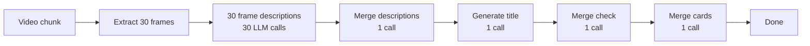

## Overview

Dayflow supports three types of AI providers for analyzing your screen activity. Each has different trade-offs for privacy, quality, cost, and performance.

<CardGroup cols={3}>
  <Card title="Gemini" icon="google">
    Cloud-based, efficient, free tier available
  </Card>
  <Card title="Local models" icon="server">
    Privacy-first, on-device, no API key needed
  </Card>
  <Card title="ChatGPT/Claude" icon="robot">
    Highest quality, requires paid subscription
  </Card>
</CardGroup>

## Comparison

| Feature | Gemini | Local Models | ChatGPT/Claude |
|---------|--------|--------------|----------------|
| **Privacy** | Cloud (can opt out of training) | Complete (on-device) | Cloud |
| **Cost** | Free tier + paid | Free (after model download) | $20/month subscription |
| **Quality** | High | Medium | Highest |
| **Speed** | Fast | Varies (GPU-dependent) | Fast |
| **Setup** | Easy (API key) | Medium (install server + model) | Medium (install CLI + subscription) |
| **Internet** | Required | Optional (after setup) | Required |
| **Battery** | Minimal impact | High impact | Minimal impact |
| **LLM calls** | 2 per analysis | 33+ per analysis | 4-6 per analysis |

## Gemini (recommended)

Google's Gemini API provides efficient video understanding with native multimodal capabilities.

### Setup

<Steps>
  <Step title="Get API key">
    1. Go to [Google AI Studio](https://ai.google.dev/gemini-api/docs/api-key)
    2. Click **Get API key**
    3. Create a new API key or use an existing one
    4. Copy the key
  </Step>
  
  <Step title="Configure Dayflow">
    1. Open Dayflow settings
    2. Select **Gemini** as your AI provider
    3. Paste your API key
    4. Click **Test Connection**
  </Step>
  
  <Step title="Enable Cloud Billing (optional but recommended)">
    To prevent Google from training on your data:
    
    1. Go to [Google Cloud Console](https://console.cloud.google.com/)
    2. Create a project (if you don't have one)
    3. Enable billing on the project
    4. Your API usage now falls under "Paid Services" data protection
    
    See [Privacy & data](/privacy) for details.
  </Step>
</Steps>

### How it works

Gemini uses native video understanding for efficient analysis:


**Total**: 2 LLM calls per 15-minute analysis

### Pricing

- **Free tier**: 15 requests per minute, 1 million tokens per day
- **Paid tier**: $0.075 per 1M input tokens, $0.30 per 1M output tokens

For typical usage (analyzing every 15 minutes), you'll stay well within the free tier.

**Source**: [Gemini API Pricing](https://ai.google.dev/gemini-api/docs/pricing)

### Pros and cons

<Accordion title="Pros">
  - Fast and efficient (only 2 LLM calls)
  - High-quality summaries
  - Free tier is generous
  - Native video understanding
  - Low battery impact
</Accordion>

<Accordion title="Cons">
  - Requires internet connection
  - Data sent to Google (can opt out of training with Cloud Billing)
  - API rate limits on free tier
</Accordion>

## Local models

Run AI models entirely on your Mac using Ollama or LM Studio. No data leaves your machine.

### Setup with Ollama

<Steps>
  <Step title="Install Ollama">
    Download and install from [ollama.com](https://ollama.com/)
    
    Or use Homebrew:
    ```bash
    brew install ollama
    ```
  </Step>
  
  <Step title="Download a vision model">
    ```bash
    ollama pull llava
    ```
    
    Other options: `llava:13b`, `llava:34b`, `bakllava`
  </Step>
  
  <Step title="Start Ollama server">
    ```bash
    ollama serve
    ```
    
    The server runs on `http://localhost:11434` by default
  </Step>
  
  <Step title="Configure Dayflow">
    1. Open Dayflow settings
    2. Select **Local** as your AI provider
    3. Choose **Ollama** as the engine
    4. Set endpoint to `http://localhost:11434`
    5. Select your model (e.g., `llava`)
    6. Click **Test Connection**
  </Step>
</Steps>

### Setup with LM Studio

<Steps>
  <Step title="Install LM Studio">
    Download from [lmstudio.ai](https://lmstudio.ai/)
  </Step>
  
  <Step title="Download a vision model">
    1. Open LM Studio
    2. Go to **Discover** tab
    3. Search for vision models (e.g., "llava")
    4. Download your preferred model
  </Step>
  
  <Step title="Start local server">
    1. Go to **Local Server** tab
    2. Select your downloaded model
    3. Click **Start Server**
    4. Note the endpoint URL (usually `http://localhost:1234`)
  </Step>
  
  <Step title="Configure Dayflow">
    1. Open Dayflow settings
    2. Select **Local** as your AI provider
    3. Choose **LM Studio** as the engine
    4. Set endpoint to `http://localhost:1234`
    5. Click **Test Connection**
  </Step>
</Steps>

### How it works

Local models reconstruct understanding from individual frame descriptions:



**Total**: 33+ LLM calls per 15-minute analysis

### Recommended models

| Model | Size | Quality | Speed | RAM Required |
|-------|------|---------|-------|--------------|
| `llava:7b` | 4.7GB | Good | Fast | 8GB |
| `llava:13b` | 8GB | Better | Medium | 16GB |
| `llava:34b` | 20GB | Best | Slow | 32GB |
| `bakllava` | 4.7GB | Good | Fast | 8GB |

### Pros and cons

<Accordion title="Pros">
  - Complete privacy (all on-device)
  - No API costs
  - Works offline (after model download)
  - Full control over data
  - No rate limits
</Accordion>

<Accordion title="Cons">
  - Requires powerful hardware (M1/M2/M3 recommended)
  - High battery drain (GPU-intensive)
  - Slower than cloud models
  - Lower quality summaries
  - Large model downloads (4-20GB)
  - Many LLM calls (33+ per analysis)
</Accordion>

### Performance tips

<Tip>
  **For best results**:
  - Use Apple Silicon Macs (M1/M2/M3)
  - Keep your Mac plugged in during analysis
  - Use smaller models (7B) for faster processing
  - Close other GPU-intensive apps
</Tip>

## ChatGPT/Claude

Use frontier reasoning models via CLI for the highest quality summaries.

### Requirements

- **ChatGPT**: Active ChatGPT Plus ($20/month) or Pro subscription
- **Claude**: Active Claude Pro subscription ($20/month)
- **Internet**: Active connection required

### Setup with ChatGPT

<Steps>
  <Step title="Install Codex CLI">
    Follow the installation guide at [github.com/openai/codex](https://github.com/openai/codex)
  </Step>
  
  <Step title="Sign in">
    ```bash
    codex auth login
    ```
    
    Sign in with your ChatGPT Plus/Pro account
  </Step>
  
  <Step title="Verify subscription">
    Ensure you have an active paid subscription (Plus or Pro)
  </Step>
  
  <Step title="Configure Dayflow">
    1. Open Dayflow settings
    2. Select **ChatGPT** as your AI provider
    3. Click **Test Connection**
  </Step>
</Steps>

### Setup with Claude

<Steps>
  <Step title="Install Claude Code">
    Follow the installation guide at [docs.anthropic.com/en/docs/claude-code](https://docs.anthropic.com/en/docs/claude-code)
  </Step>
  
  <Step title="Sign in">
    ```bash
    claude auth login
    ```
    
    Sign in with your Claude Pro account
  </Step>
  
  <Step title="Verify subscription">
    Ensure you have an active Claude Pro subscription
  </Step>
  
  <Step title="Configure Dayflow">
    1. Open Dayflow settings
    2. Select **Claude** as your AI provider
    3. Click **Test Connection**
  </Step>
</Steps>

### How it works

ChatGPT/Claude uses CLI tools to batch-process extracted frames:


**Total**: 4-6 LLM calls per 15-minute analysis

### Pros and cons

<Accordion title="Pros">
  - Highest quality summaries
  - Best narrative understanding
  - Efficient (4-6 LLM calls)
  - Reliable performance
  - Low battery impact
</Accordion>

<Accordion title="Cons">
  - Requires paid subscription ($20/month)
  - Data sent to OpenAI/Anthropic
  - Requires internet connection
  - CLI setup required
</Accordion>

## Switching providers

You can change your AI provider at any time:

<Steps>
  <Step title="Open settings">
    Click the Dayflow menu bar icon and select **Settings**
  </Step>
  
  <Step title="Select new provider">
    Choose **Gemini**, **Local**, **ChatGPT**, or **Claude**
  </Step>
  
  <Step title="Configure">
    Enter required credentials or endpoints
  </Step>
  
  <Step title="Test connection">
    Click **Test Connection** to verify setup
  </Step>
</Steps>

<Note>
  Switching providers doesn't affect your existing timeline data. New analyses will use the new provider.
</Note>

## Troubleshooting

<AccordionGroup>
  <Accordion title="Gemini: API key invalid">
    - Verify your API key is correct
    - Check that the key hasn't been revoked
    - Ensure you're not hitting rate limits
    - Try creating a new API key
  </Accordion>
  
  <Accordion title="Local: Connection failed">
    - Verify the server is running (`ollama serve` or LM Studio server)
    - Check the endpoint URL is correct
    - Ensure no firewall is blocking localhost connections
    - Try restarting the local server
  </Accordion>
  
  <Accordion title="Local: Slow or crashes">
    - Use a smaller model (e.g., `llava:7b` instead of `llava:34b`)
    - Ensure your Mac is plugged in
    - Close other GPU-intensive applications
    - Check Activity Monitor for memory pressure
  </Accordion>
  
  <Accordion title="ChatGPT/Claude: Authentication failed">
    - Verify you have an active paid subscription
    - Re-run the auth login command
    - Check that the CLI is installed correctly
    - Ensure you're signed in to the correct account
  </Accordion>
  
  <Accordion title="ChatGPT/Claude: Subscription required">
    You must have an active paid subscription:
    - ChatGPT Plus ($20/month) or Pro
    - Claude Pro ($20/month)
    
    Free tiers are not supported for CLI access.
  </Accordion>
</AccordionGroup>

## Best practices

<CardGroup cols={2}>
  <Card title="Start with Gemini" icon="google">
    Best balance of quality, speed, and ease of setup for most users
  </Card>
  <Card title="Enable Cloud Billing" icon="shield">
    Prevent Google from training on your data (Gemini users)
  </Card>
  <Card title="Use local for sensitive work" icon="lock">
    Switch to local models when working with confidential information
  </Card>
  <Card title="Stay plugged in" icon="plug">
    Keep your Mac plugged in when using local models
  </Card>
  <Card title="Monitor usage" icon="chart-line">
    Check your API usage in Google AI Studio or provider dashboard
  </Card>
  <Card title="Test before committing" icon="flask">
    Use the Test Connection button to verify setup before starting
  </Card>
</CardGroup>

## Next steps

<CardGroup cols={2}>
  <Card title="Privacy & data" icon="shield" href="/privacy">
    Understand how each provider handles your data
  </Card>
  <Card title="Features" icon="sparkles" href="/features">
    Explore what you can do with your timeline
  </Card>
  <Card title="Quickstart" icon="rocket" href="/quickstart">
    Complete setup and start using Dayflow
  </Card>
  <Card title="Automation" icon="robot" href="/automation">
    Control Dayflow with URL schemes
  </Card>
</CardGroup>
